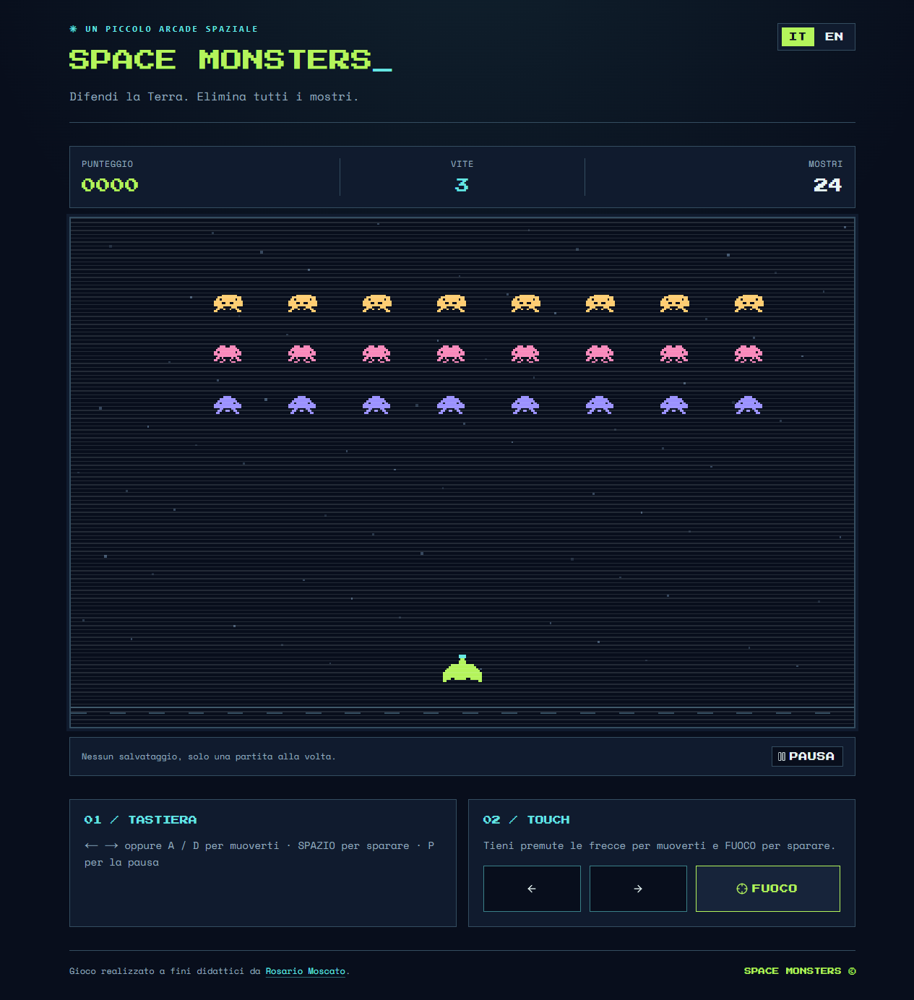

# Space Monsters



**Space Monsters** è un piccolo gioco arcade ispirato a Space Invaders: muovi la navicella, spara ai mostri e difendi la Terra in una sola ondata. Hai tre vite; puoi giocare con tastiera o touch e scegliere tra italiano e inglese.

## Come è fatto

Next.js (App Router), React e TypeScript per l'applicazione; Tailwind CSS e shadcn/ui per l'interfaccia; Canvas 2D per grafica e animazione del gioco. La partita gira nel browser: non servono account, database o servizi esterni. Lo stile 8-bit è descritto in [DESIGN.md](DESIGN.md).

## Avvio

Richiede Node.js e npm. Nella cartella del progetto:

```sh
npm install
npm run dev
```

Apri l'indirizzo indicato dal terminale (di norma http://localhost:3000). Per verificare il progetto: `npm test`, `npm run typecheck`, `npm run lint` e `npm run build`.

## Controlli

- Computer: frecce sinistra/destra o A/D per muoverti, barra spaziatrice per sparare, P per mettere in pausa.
- Telefono: tieni premuti i pulsanti sotto il campo da gioco.

Prima della pubblicazione, imposta `APP_URL` sull'indirizzo definitivo per sitemap e anteprima dei link.
